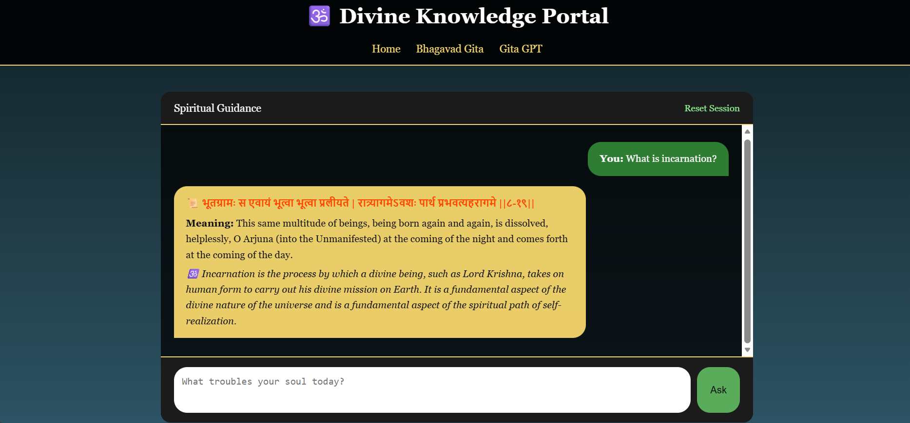

# 🕉️ Divine Knowledge Portal  
### Bhagavad Gita Explorer + GitaGPT (Context-Aware AI Spiritual Assistant)

A full-stack AI-powered spiritual portal that combines structured scripture access with a context-aware conversational AI built using Retrieval-Augmented Generation (RAG).

---

# 🚀 Project Overview

The Divine Knowledge Portal is a hybrid AI system that integrates structured scripture exploration with retrieval-grounded conversational AI.

1. 📖 Structured Bhagavad Gita exploration
2. 🔎 Semantic verse search
3. 🧠 Context-aware AI dialogue (GitaGPT)
4. 💾 Session-based memory
5. 🎯 Retrieval-augmented response generation

It demonstrates retrieval-grounded conversational AI applied to a structured spiritual corpus.

## 🖼️ GitaGPT Preview



---

# ✨ Key Features

## 1️⃣ Bhagavad Gita Explorer

- Structured verse browsing
- Shloka + English meaning display
- Word-wise meaning of all Sanskrit words
- Clean verse formatting
- Chapter-wise scripture access
- Lightweight and readable interface

---

## 2️⃣ GitaGPT (AI Spiritual Guide)

- Semantic verse grounding
- Context-aware follow-up detection
- Persona-controlled concise responses

---

# 🏗️ System Architecture

```
User Query
     ↓
Intent & Follow-up Detection
     ↓
Semantic Embedding (MiniLM)
     ↓
FAISS Vector Search
     ↓
Contextual Relevance Scoring
     ↓
Verse Selection
     ↓
TinyLlama Persona Generation
     ↓
Response + Session Memory Update
```

---

# 🧩 Retrieval Strategy

- Embedding dimension: 384
- Similarity metric: Cosine similarity
- Top-k retrieval: k=5
- Threshold gating to prevent weak matches

---

# 🔍 How Retrieval Works

1. User query converted to embedding.
2. FAISS retrieves top-k similar verses.
3. Similarity threshold applied.
4. If score is strong → verse is injected.
5. If weak → direct AI wisdom.
6. LLM generates grounded response.

This prevents:
- Random verse injection
- Hallucinated references
- Topic misalignment

---

# 🧠 Core Technologies Used

| Component | Technology |
|------------|------------|
| Backend | Flask |
| Embeddings | SentenceTransformers (all-MiniLM-L6-v2, 384-dim, cosine similarity) |
| Vector Search | FAISS |
| LLM | TinyLlama 1.1B Chat |
| Session Memory | Flask session storage |
| Dataset | Structured Bhagavad Gita CSV |

---

# ⚙️ Design Considerations

✔ Uses CPU-based inference for accessibility  
✔ Limits conversation history for memory efficiency  
✔ Applies similarity threshold to prevent weak retrieval  
✔ Avoids hardcoded emotional keyword rules  
✔ Separates retrieval and generation layers  

---

# 📌 Architectural Decisions

✔ Chose MiniLM for lightweight semantic embeddings  
✔ Used FAISS for efficient in-memory vector similarity  
✔ Implemented threshold-based gating to reduce irrelevant verse injection  
✔ Separated retrieval and generation layers for modularity  
✔ Designed session memory to balance context and efficiency  

---

# 📊 Project Highlights

This project demonstrates:

✔ End-to-end AI system design  
✔ Retrieval-Augmented Generation (RAG)  
✔ Vector database integration (FAISS)  
✔ Context tracking & conversational memory  
✔ Persona conditioning  
✔ Prompt engineering  
✔ Lightweight LLM deployment on CPU  
✔ Applied NLP system implementation  

---

# 🛠 Installation & Setup

## 1️⃣ Clone Repository

```bash
git clone https://github.com/PNSC21/divine-knowledge.git
cd divine-knowledge
```

## 2️⃣ Install Dependencies

```bash
pip install -r requirements.txt
```

## 3️⃣ Run Application

```bash
python app.py
```

Visit:

```
http://127.0.0.1:5000
```

---

# 🎯 Why This Project Stands Out

- Builds embeddings locally
- Uses vector similarity search
- Implements contextual gating
- Controls persona tone
- Maintains structured session memory

It reflects system-level thinking, not just API usage.

---

# 📈 Future Improvements

- Upgrade to larger LLM (e.g., Llama 3 / Mistral)
- Multi-verse contextual synthesis
- Cloud deployment (AWS / GCP)
- User-level conversation history persistence
- Chapter-wise semantic clustering 

---

# 🧘 Vision

To build structured, context-aware AI systems that responsibly integrate classical knowledge with modern NLP techniques -  while preserving contextual integrity and philosophical depth.

---

If you found this project interesting, feel free to connect or contribute.
